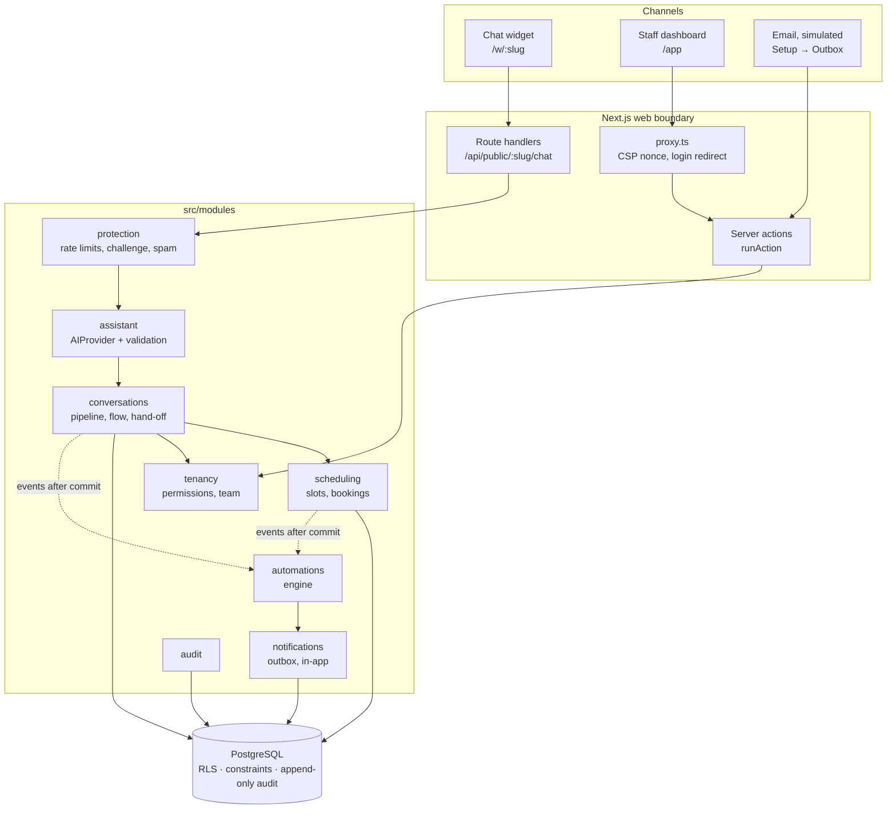

# Architecture

Relay is a **modular monolith**: one Next.js application and one PostgreSQL database. The web layer
(`src/app`) is thin; business rules live in modules (`src/modules`) that every entry point — the public chat,
the dashboard, the simulated email channel and automations — calls in the same way.

The interactive version of this document is at `/learn/architecture` in the running app.

## Contents

- [System overview](#system-overview)
- [Request lifecycle](#request-lifecycle)
- [The chat pipeline](#the-chat-pipeline)
- [Tenant isolation](#tenant-isolation)
- [Actors and permissions](#actors-and-permissions)
- [Scheduling and double-booking](#scheduling-and-double-booking)
- [Events, automations and the outbox](#events-automations-and-the-outbox)
- [Provider boundaries](#provider-boundaries)
- [Data model](#data-model)
- [Code layout](#code-layout)

---

## System overview



**Stack:** Next.js 16.3 (App Router, Turbopack), React 19.3, TypeScript 6.0, Tailwind CSS 4.3, Zod 4,
Prisma 7.10 with the `pg` driver adapter, PostgreSQL 18.4, Vitest 5, Playwright 1.63 with axe.

---

## Request lifecycle

Every request that touches business data follows the same shape:

1. **Enter** through the proxy (pages), a route handler (public API) or a server action (forms).
2. **Identify the actor on the server** — from the verified session cookie and the memberships table
   (`src/server/context.ts`), or from the public URL slug for customers. Nothing in the request body can
   choose the organization.
3. **Guard**: rate limits, the bot challenge where relevant, Zod validation of the input.
4. **Enter a tenant transaction** with `withTenant(organizationId, fn)`.
5. **Call services**, which `authorizeIn(scope, ctx, permission)`, validate again, apply business rules,
   write the change, its audit entry and any outbound email in the same transaction, and return
   `{ result, events }`.
6. **Commit**, then dispatch domain events to the automation engine.
7. **Respond.** Expected errors (`AppError`) become field errors or safe messages; unexpected errors are
   logged with a short reference and never leak details.

---

## The chat pipeline

`src/modules/conversations/pipeline.ts` → `handleChatInput`:

```
protect → identify business → understand → decide → act → persist → react → respond
```

| Step       | What happens                                                                                                                                                          | Where                                          |
| ---------- | --------------------------------------------------------------------------------------------------------------------------------------------------------------------- | ---------------------------------------------- |
| Protect    | Validate the input union, rate-limit per IP and per conversation, require the challenge for a new conversation                                                        | `protection/*`, `conversations/model.ts`       |
| Identify   | Look up the organization from the URL slug; for an existing conversation, match id + organization + SHA-256 of the token from the `x-relay-conversation-token` header | `tenancy/organizations.ts`, `conversations.ts` |
| Understand | For free text only, call `understand()` **outside any transaction** (a real model can take seconds)                                                                   | `assistant/provider.ts`                        |
| Decide     | Lock the conversation row (`FOR UPDATE`), re-read state, run the deterministic state machine `runFlow`                                                                | `conversations/flow.ts`                        |
| Act        | The flow requests side effects through `FlowPorts`; the pipeline implements them with real services under the assistant's actor context                               | `pipeline.ts`                                  |
| Persist    | Messages, new state, bookings, leads, audit entries and outbox emails — one transaction                                                                               |                                                |
| React      | `runAutomations(events)` after commit                                                                                                                                 | `automations/engine.ts`                        |
| Respond    | Messages created since the customer's input (including automation replies) and, after a booking, the private manage link                                              |                                                |

The flow's state is a validated discriminated union stored on the conversation:
`idle → booking.service → booking.slot → booking.details → booking.confirm`, plus `quote.details`,
`handoff.contact` and `handed_off`. Offered slots are kept in state as `s1…s6`; the browser only ever sends
a slot id, so a tampered request cannot book a time that was never offered.

The widget stores the conversation id and token in `localStorage` and polls
`GET /api/public/:slug/chat/:conversationId?after=<messageId>` every 5 seconds while open, which is how
staff replies arrive.

---

## Tenant isolation

Relay uses **shared tables with row-level security**.

- Every business table has an `organizationId` column and a policy:

  ```sql
  CREATE POLICY tenant_isolation ON "Booking"
    USING ("organizationId" = app_current_org_id())
    WITH CHECK ("organizationId" = app_current_org_id());
  ```

- `app_current_org_id()` returns `NULLIF(current_setting('app.org_id', true), '')::uuid` — so when no
  organization is set, every policy is false and queries return nothing (**fail closed**).
- `withTenant` (`src/lib/db.ts`) runs work in an interactive transaction and first executes
  `set_config('app.org_id', <uuid>, true)`. The `true` makes the setting **transaction-local**, so a pooled
  connection cannot carry it into another request.
- The app connects as **`relay_app`**: not a superuser, `NOBYPASSRLS`, and not the owner of the tables (owners
  bypass RLS). Migrations run as **`relay_owner`**. An integration test asserts these role attributes.
- **Composite foreign keys** on `(organizationId, id)` stop a row in one business from referencing a row in
  another, even with a guessed id.
- The **`TenantDb` branded type** makes it a compile error to pass the raw Prisma client where tenant-scoped
  access is expected.
- `authorizeIn` also checks that the actor's organization equals the transaction's organization.

**Not under RLS, by design:** `User`, `Session`, `Organization`, `Membership`, `Invite` and
`RateLimitBucket`. They are read before a tenant is known (login, invite acceptance, public page lookup) and
are only touched by the auth, tenancy and protection modules.

---

## Actors and permissions

Every service receives an `ActorContext` (`src/modules/tenancy/context.ts`):

| Actor        | Built from                             | Permissions                                                                        |
| ------------ | -------------------------------------- | ---------------------------------------------------------------------------------- |
| `member`     | Verified session + membership          | `ROLE_PERMISSIONS` by role: Owner, Admin, Staff                                    |
| `assistant`  | The chat pipeline for one conversation | reply, create booking, create lead, create task, hand off, notify, email           |
| `automation` | The engine, per automation             | reply, assign, update lead, create task, hand off, notify, email — **no bookings** |
| `customer`   | A booking's private manage link        | cancel **their own** booking, outside the cancellation window                      |
| `system`     | Onboarding and seeding only            | everything; never built from a request                                             |

Checks live **inside services**, so every channel is protected by the same code. The UI hides actions a
role cannot use, but that is a convenience, not the control.

---

## Scheduling and double-booking

- `findAvailableSlots` (`scheduling/slots.ts`) is a **pure function**: staff weekly hours, time off, busy
  intervals, policy (minimum notice, horizon, slot interval), `now` and the IANA time zone in; ranked slots
  out. Local wall-clock minutes are converted per date, so daylight-saving changes come out right. When
  several people are free, the least busy that day is preferred.
- `availability.ts` loads the inputs inside the tenant transaction. `findExactSlot` re-applies the same rules
  to one start time at booking time.
- `createBooking` inserts inside a `SAVEPOINT` loop over the ranked free staff. The database is the final
  guard:

  ```sql
  ALTER TABLE "Booking" ADD CONSTRAINT "Booking_no_overlapping_staff_time"
    EXCLUDE USING gist ("staffMemberId" WITH =, tstzrange("startsAt", "endsAt", '[)') WITH &&)
    WHERE (status IN ('PENDING', 'CONFIRMED'));
  ```

  A violation (SQLSTATE `23P01`) rolls back to the savepoint and tries the next free person, or returns
  CONFLICT, which the chat turns into "that time was just taken" with new options.

- Times are stored as `timestamptz` instants; rules are evaluated in the business's time zone
  (`Europe/Oslo` in the demo).

---

## Events, automations and the outbox

- Services return **domain events** (`src/modules/events.ts`): `conversation.started`, `booking.requested`,
  `booking.confirmed`, `booking.cancelled`, `lead.created`, `conversation.handed_off`.
- Callers dispatch them **after commit** with `runAutomations(events)`. For each enabled automation on the
  matching trigger, the engine re-validates the stored definition, evaluates conditions, **claims the run**
  with a unique `(automationId, eventId)` insert (idempotency), executes actions one by one in their own
  transactions as the `automation` actor, and records per-step results plus an audit entry.
- Events produced by actions are not dispatched again, so automations cannot trigger automations.
- **Emails** are written to `OutboundEmail` inside the transaction that caused them (transactional outbox).
  With the demo provider they stay `STORED_IN_OUTBOX`; a real provider would get `QUEUED` rows for a delivery
  worker.
- **Limitation:** event dispatch is in-process. A crash between commit and dispatch loses those automation
  runs. The next step is a durable event table read by a worker (`FOR UPDATE SKIP LOCKED`); runs are already
  idempotent, so at-least-once delivery would be safe.

---

## Provider boundaries

External capabilities sit behind small interfaces with demo implementations. Environment validation
(`src/lib/env.ts`) only accepts the providers that exist in this build.

| Boundary  | Interface                                                 | Demo implementation                                           | Contract                                                                                                                         |
| --------- | --------------------------------------------------------- | ------------------------------------------------------------- | -------------------------------------------------------------------------------------------------------------------------------- |
| AI        | `AIProvider.interpret(request, signal): Promise<unknown>` | `mock-provider.ts` — rules, IDF keyword matching, chrono-node | Output is validated against `interpretationSchema`; ids must belong to the catalogue sent; 8-second timeout; failure → `unknown` |
| Email     | `EmailProvider.deliver(message)`                          | `demoEmailProvider` — stores in the outbox, `deliver` throws  | Emails are queued in the caller's transaction; delivery is asynchronous                                                          |
| Bot check | `ChallengeProvider.issue()` / `verify(input)`             | Honeypot + HMAC-signed render timestamp (≥ 1.5 s, ≤ 2 h)      | Required for new conversations and sign-up                                                                                       |

The AI provider receives only the message, the business's local date and time, the conversation step, and the
public catalogue (service names and keywords, FAQ questions and keywords) — no prices, customer data or
history. See [docs/ai-provider.md](docs/ai-provider.md).

---

## Data model

`prisma/schema.prisma` · constraints in `prisma/migrations/*_tenant_isolation_and_constraints`.

| Area               | Models                                                                                                                       |
| ------------------ | ---------------------------------------------------------------------------------------------------------------------------- |
| Identity & tenancy | `User`, `Session`, `Organization` (profile, opening hours JSON, booking policy), `Membership` (role), `Invite`               |
| Scheduling         | `StaffMember`, `WorkingHours`, `TimeOff`, `Service` (bookable or quote, instant or approval), `StaffService`, `Booking`      |
| Conversations      | `Customer`, `Conversation` (state JSON, status, assistant active, hand-off times), `Message` (blocks, stored interpretation) |
| Work               | `Lead`, `Task`, `Notification`                                                                                               |
| Knowledge          | `KnowledgeItem` (question, answer, keywords, published)                                                                      |
| Automations        | `Automation` (trigger, conditions and actions JSON), `AutomationRun` (steps, status)                                         |
| Records            | `OutboundEmail`, `AuditLog`, `RateLimitBucket`                                                                               |

Database-level rules beyond Prisma's schema: RLS policies, the booking exclusion constraint, CHECK constraints
(time ranges, bookable services need a duration, non-negative prices, policy ranges), and privileges that make
`AuditLog` append-only for the app role. Secret tokens (sessions, invites, conversation access, booking manage
links) are stored only as SHA-256 hashes.

---

## Code layout

```
src/app/                 Next.js routes
  (auth)/                login, sign-up, logout actions
  onboarding/            first business setup
  invite/[token]/        accept a team invitation
  w/[slug]/              public business page, chat widget, manage-booking page
  api/public/[slug]/chat public JSON API for the widget
  app/                   dashboard: today, inbox, bookings, leads, tasks, customers,
                         automations, analytics, audit, setup
  learn/                 the guided tour of the codebase
src/modules/             business logic (no React)
src/server/              request-scoped helpers (session, context, actions, http)
src/lib/                 db, env, errors, time, tokens, logger
src/components/          shared UI
src/content/             demo accounts and /learn content
prisma/                  schema, migrations, seed
scripts/                 db.mjs, setup.mjs, e2e-server.mjs
tests/integration/       Vitest against real PostgreSQL
tests/e2e/               Playwright + axe
```
